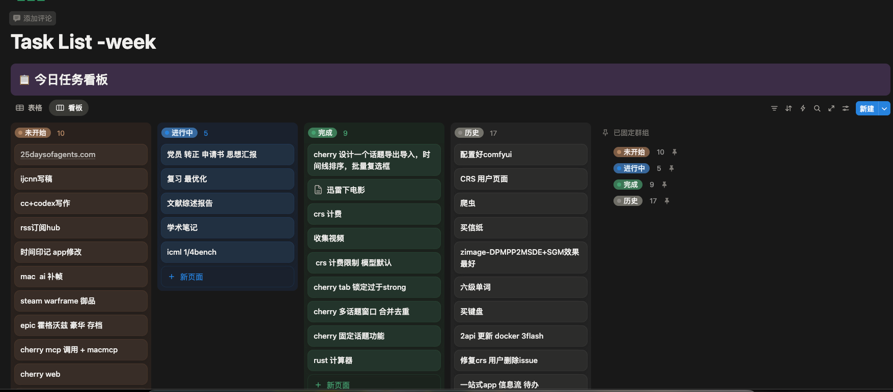

# ViewBoard

> Notion 风格的本地优先看板应用，支持 WebDAV 同步与桌面托盘。



## 功能亮点
- 看板与表格双视图，支持拖拽排序与状态流转
- WebDAV 同步（坚果云 / Nextcloud）
- IndexedDB 离线存储，重启不丢数据
- 系统托盘与快捷操作
- 主题切换：黑夜 / 白天 / 跟随系统

## 技术栈
- React 18 + TypeScript + Vite
- Tauri 2
- Bun
- Tailwind CSS
- Zustand + idb
- tsdav

## 快速开始
### 环境要求
- Bun
- Rust（stable）
- macOS 或 Windows

### 安装依赖
```bash
bun install
```

### 开发调试
```bash
bun run tauri dev
```

仅前端预览：
```bash
bun run dev
```

### 主题切换
右侧工具栏的“主题”按钮循环切换（跟随系统 → 黑夜 → 白天），
设置保存在 `localStorage` 的 `vb-theme`。

## 打包构建
macOS DMG：
```bash
bun run tauri build --bundles dmg
```

Windows EXE（NSIS）：
```bash
bun run tauri build --bundles nsis
```

产物路径：
- `src-tauri/target/release/bundle/dmg/`
- `src-tauri/target/release/bundle/nsis/`

## 自动发布（GitHub Actions）
已配置 GitHub Actions：推送 `v*` 标签后自动构建并发布 Release，
同时产出 macOS DMG 与 Windows EXE。

发布步骤：
1. 更新版本号（`package.json` 与 `src-tauri/tauri.conf.json`）
2. 提交代码并打标签

```bash
git tag v0.1.0
git push origin v0.1.0
```

工作流文件：`.github/workflows/release.yml`
